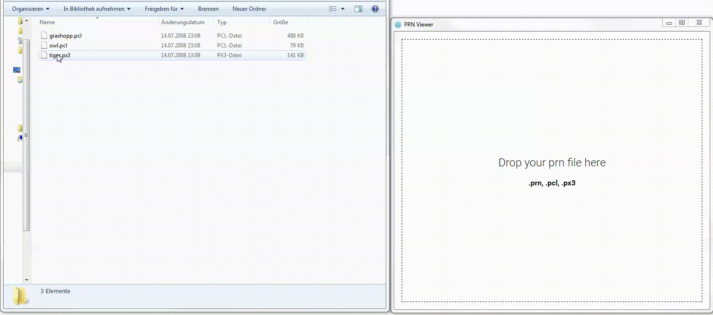
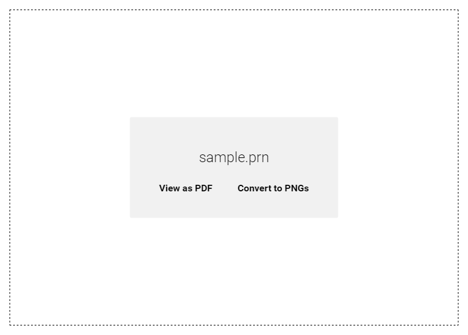

# PCL Viewer

Modern [PCL](https://de.wikipedia.org/wiki/Printer_Command_Language) (Printer Command Language) Viewer.



## File formats supported

It supports the following file formats

* `.pcl`
* `.px3`
* `.prn`

## Conversion options

You can create both a full `.pdf` file or per-page `.png`'s.



* **Use png** conversion if you want faster generation times.
* **Use pdf** conversion if you want full text search

## Build steps

The `package` command creates a standalone distributable which you can run.

```bash
$ npm install
$ npm run package
```

## How it works

### Conversion

It basically utilizes ghostscript to convert pcl files to pdf or png files. This has the advantage that we can offload the actual _viewing_ to more stable programs like `Adobe Reader` which can handle 20'000+ pages without problems.

## Caveats

When converting a large file to pdf it takes significant amount of memory to build up the state tree. At this time, only headers are written to the output file. This gives the sense that it almost doesn't do anything. Just give it it's time until the state tree has been built up and it will write the file down pretty quick afterwards.